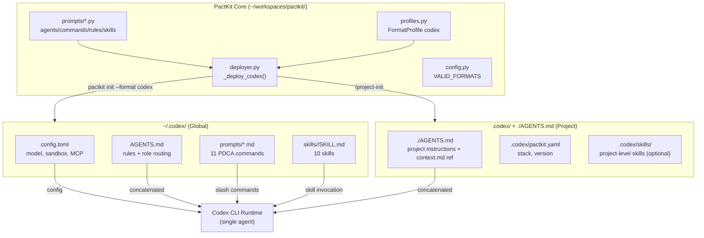
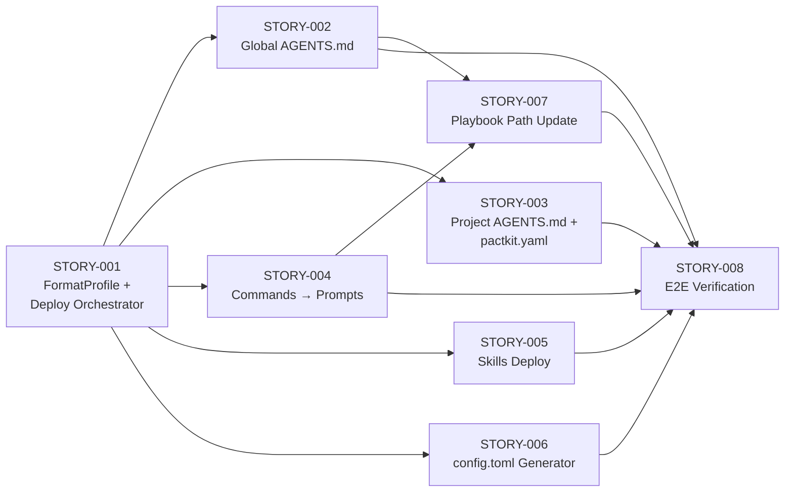

# Product Requirements Document: PactKit Codex Integration
- **Version**: 1.0
- **Date**: 2026-03-25

---

## 1. Product Overview

### 1.1 Vision
> 让 PactKit PDCA 工作流框架在 OpenAI Codex CLI 上开箱即用，使 Codex CLI 用户获得与 Claude Code / OpenCode 用户同等的结构化项目管理体验。

### 1.2 Problem Statement
PactKit 已支持 Claude Code 和 OpenCode 两个 AI 编码助手平台。Codex CLI 是 OpenAI 推出的开源终端 AI 编码助手，用户群快速增长，但缺乏结构化的 PDCA 项目管理工作流。本项目为 PactKit 新增 `--format codex` 部署目标，将 9 agents、11 commands、10 skills、9 rules 适配到 Codex CLI 的文件结构中。

**核心挑战**：Codex CLI 是单 agent 架构（无 multi-role），无 `@import` 规则加载，但拥有自定义 slash commands（`~/.codex/prompts/`）、正式 skills 系统（`.codex/skills/`）、完整 MCP 支持和 hooks 系统——能力比初始预期更强。

### 1.3 Target Users
- **Primary**: 使用 Codex CLI 的开发者，希望获得 PactKit PDCA 结构化工作流
- **Secondary**: PactKit 现有用户（Claude Code / OpenCode），需要在 Codex CLI 环境中保持一致体验

---

## 2. User Personas

### Persona 1: 全栈开发者 Alex
- **Role**: 独立开发者 / 小团队 tech lead，主用 Codex CLI
- **Goals**: 用结构化流程管理 AI 辅助开发，避免 "对话式编码" 的混乱
- **Pain Points**: Codex CLI 没有 PDCA 流程，每次开新项目都要手动建 spec/board/test 结构
- **Jobs-to-be-Done**:
  - *Functional*: 一键初始化项目结构，按 Plan→Act→Check→Done 流程推进
  - *Emotional*: 感觉项目在掌控之中，而不是 AI 随意生成代码
  - *Social*: 向团队展示可追溯的开发流程

### Persona 2: PactKit 老用户 Sam
- **Role**: PactKit Claude Code 用户，公司新增 Codex CLI 作为备选工具
- **Goals**: 在 Codex CLI 中复用已熟悉的 `/project-plan`, `/project-act` 等命令
- **Pain Points**: 切换工具后失去 PactKit 工作流，需要重新适应
- **Jobs-to-be-Done**:
  - *Functional*: `pactkit init --format codex` 即可部署全套工作流到 Codex CLI
  - *Emotional*: 工具可以换，工作流不变
  - *Social*: 跨工具的一致性体现专业度

---

## 3. Feature Breakdown

### Epic 1: Deploy Architecture (deployer.py)

| Story | Description | Impact (1-5) | Effort (1-5) | Priority (I/E) | Horizon |
|-------|-------------|:------------:|:------------:|:--------------:|---------|
| STORY-001 | Codex FormatProfile + `_deploy_codex()` orchestrator | 5 | 3 | 1.67 | Now |
| STORY-002 | Global AGENTS.md generator (inline rules + role routing) | 5 | 3 | 1.67 | Now |
| STORY-003 | Project-level AGENTS.md + `.codex/pactkit.yaml` generator | 4 | 2 | 2.00 | Now |

### Epic 2: Commands as Codex Prompts

| Story | Description | Impact (1-5) | Effort (1-5) | Priority (I/E) | Horizon |
|-------|-------------|:------------:|:------------:|:--------------:|---------|
| STORY-004 | Convert 11 command playbooks to `~/.codex/prompts/*.md` format | 5 | 3 | 1.67 | Now |

### Epic 3: Skills Adaptation

| Story | Description | Impact (1-5) | Effort (1-5) | Priority (I/E) | Horizon |
|-------|-------------|:------------:|:------------:|:--------------:|---------|
| STORY-005 | Deploy 10 skills to `~/.codex/skills/` with SKILL.md | 4 | 2 | 2.00 | Now |

### Epic 4: Config & CLI

| Story | Description | Impact (1-5) | Effort (1-5) | Priority (I/E) | Horizon |
|-------|-------------|:------------:|:------------:|:--------------:|---------|
| STORY-006 | `config.toml` generator (MCP, sandbox, approval_policy) | 4 | 2 | 2.00 | Now |
| STORY-007 | Update all playbook text paths for Codex environment | 3 | 2 | 1.50 | Now |

### Epic 5: Verification & Polish

| Story | Description | Impact (1-5) | Effort (1-5) | Priority (I/E) | Horizon |
|-------|-------------|:------------:|:------------:|:--------------:|---------|
| STORY-008 | End-to-end verification in real Codex CLI session | 5 | 2 | 2.50 | Now |

---

## 4. Architecture Design



### Tech Stack
- **Language**: Python (PactKit core)
- **Output Format**: Markdown (AGENTS.md, prompts, SKILL.md) + TOML (config.toml)
- **Target Runtime**: Codex CLI (Rust binary)
- **No frontend/backend/database** — this is a deployment tool, not a web app

---

## 5. Deployment Artifacts (replaces Page/Screen Design)

### Artifact 1: Global AGENTS.md (`~/.codex/AGENTS.md`)
- **Purpose**: Provide base PactKit rules and agent role descriptions to all Codex projects
- **Content**: Inlined core rules (hierarchy-of-truth, file-atlas, workflow-conventions, etc.) + 9 agent role descriptions as prompt sections + routing table
- **Size Budget**: < 20KB (to stay within `project_doc_max_bytes` default)

### Artifact 2: Codex Prompts (`~/.codex/prompts/*.md`)
- **Purpose**: Make all 11 PDCA commands available as slash commands in Codex TUI
- **Format**: YAML frontmatter (`description`, `argument-hint`) + playbook body
- **Files**: `project-init.md`, `project-plan.md`, `project-act.md`, `project-check.md`, `project-done.md`, `project-hotfix.md`, `project-design.md`, `project-clarify.md`, `project-release.md`, `project-pr.md`, `project-sprint.md`

### Artifact 3: Codex Skills (`~/.codex/skills/<name>/SKILL.md`)
- **Purpose**: Deploy PactKit skills (board, scaffold, visualize, etc.)
- **Format**: SKILL.md with `name` + `description` frontmatter + scripts/ subdirectory

### Artifact 4: config.toml (`~/.codex/config.toml`)
- **Purpose**: Configure MCP servers, sandbox mode, approval policy
- **Strategy**: Merge — preserve user fields, update managed PactKit fields

---

## 6. CLI Interface Design (replaces API Design)

### Commands
| Command | Description |
|---------|-------------|
| `pactkit init --format codex` | Deploy global PactKit artifacts to `~/.codex/` |
| `pactkit update --format codex` | Update existing deployment (merge strategy) |

### Data Model: FormatProfile (codex)
```python
FormatProfile(
    name="codex",
    display_name="Codex CLI",
    global_config_dir="~/.codex",
    project_config_dir=".codex",
    skills_dir="~/.codex/skills",
    agents_dir=None,               # No agent files (single agent)
    commands_dir=None,              # Commands are "prompts" in ~/.codex/prompts/
    prompts_dir="~/.codex/prompts", # Codex-specific: custom slash commands
    rules_dir=None,                 # Rules inlined into AGENTS.md
    project_instructions_file="AGENTS.md",
    global_instructions_file="AGENTS.md",
    pactkit_yaml_path=".codex/pactkit.yaml",
    agent_format="md",
    rules_import_style="inline",
    has_custom_commands=False,       # No "commands" concept, but has "prompts"
    has_custom_prompts=True,         # Codex-specific capability
    supports_model_routing=False,
    supports_mcp=True,
)
```

### Key Format Conversions
| Source (Claude Code) | Target (Codex CLI) | Conversion |
|---------------------|-------------------|------------|
| `allowed-tools: [Read, Write]` | Remove (Codex has no per-command tool restriction) |
| `description: "..."` | `description: "..."` (same) |
| `$ARGUMENTS` placeholder | `argument-hint: "..."` in frontmatter |
| `@./rules/file.md` import | Inline into AGENTS.md |
| `settings.json` hooks | `config.toml` hooks section |
| `settings.json` mcpServers | `[mcp_servers.*]` in config.toml |

---

## 7. Non-Functional Requirements

- **Compatibility**: Must work with Codex CLI Rust version (codex-rs). Legacy TypeScript version is out of scope.
- **Size Budget**: Global AGENTS.md < 20KB; individual prompt files < 5KB each
- **Idempotency**: `pactkit init --format codex` is idempotent — re-running doesn't duplicate content
- **Merge Safety**: config.toml updates preserve user fields (API keys, custom providers) — only update PactKit-managed sections
- **No Secret Leakage**: No provider-specific model IDs, API keys, or org-specific identifiers in deployed files
- **Standalone Scripts**: Skills scripts (board.py, scaffold.py, visualize.py) must run without `import pactkit` — inline all needed logic

---

## 8. Success Metrics

| Epic | Metric | Target | How to Measure |
|------|--------|--------|----------------|
| Deploy Architecture | `pactkit init --format codex` completes without error | 100% | CI test |
| Commands | All 11 `/project-*` commands appear in Codex TUI slash menu | 11/11 | Manual verification |
| Skills | All 3 script skills execute in Codex sandbox | 3/3 | `codex exec` test |
| Config | MCP servers connect successfully in Codex session | context7 works | Manual verification |
| E2E | Complete PDCA cycle (init→plan→act→check→done) in Codex CLI | 1 full cycle | Manual walkthrough |

---

## 9. MVP Roadmap

### Now (Sprint 1): Core MVP — all stories
> All 8 stories are MVP — this is a focused integration project.
- [ ] STORY-001: Codex FormatProfile + deploy orchestrator
- [ ] STORY-002: Global AGENTS.md generator (rules + role routing)
- [ ] STORY-003: Project-level AGENTS.md + pactkit.yaml generator
- [ ] STORY-004: Convert 11 commands to Codex prompts format
- [ ] STORY-005: Deploy 10 skills to ~/.codex/skills/
- [ ] STORY-006: config.toml generator (MCP, sandbox, hooks)
- [ ] STORY-007: Update playbook text paths for Codex
- [ ] STORY-008: End-to-end verification in real Codex CLI

### Next: Iteration based on real usage
- Hooks integration (session_start → CI health check)
- Prompt-level model routing protocol
- AGENTS.md size optimization based on real `project_doc_max_bytes` testing

### Later: Upstream contribution
- PR to pactkit main repo to add `--format codex` natively
- Codex-specific test suite in CI

---

## 10. Story Dependency Graph

